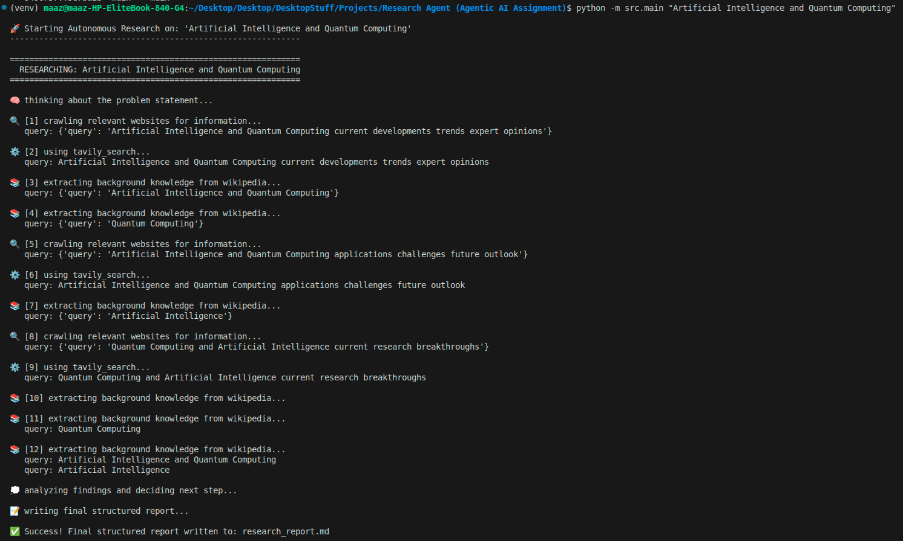

# Autonomous Research Agent 🚀

An autonomous AI research agent built using **LangChain**, **Groq** (LLaMA 3), and web search tools. The agent takes a topic, autonomously decides what to research, gathers information from the live web and Wikipedia, and synthesizes its findings into a highly structured, 7-part Markdown report — all in under 60 seconds.

## 🌟 Features
- **ReAct Agent Architecture**: Uses LangChain's LangGraph-based `create_agent` API to think, act, and observe in an autonomous loop.
- **Dual Tool Integration**: 
  - 🌐 *Tavily Web Search*: For recent trends, expert opinions, and live developments.
  - 📚 *Wikipedia API*: For foundational background, history, and definitions.
- **Custom Tool Truncation**: Wraps all API responses to safely truncate output, staying heavily within free-tier Groq API TPM (Tokens Per Minute) limits.
- **Two-Stage Pipeline**:
  1. *Research Phase*: The agent autonomously researches and collects unformatted raw notes.
  2. *Synthesis Phase*: A dedicated Report Generator LLM chain formats those notes into a strict 7-section Markdown report.
- **Deep Visibility**: Custom LangChain callback handlers (`on_tool_start`) trace every agent decision, tool use, and search query directly to the terminal.

## 🛠️ Tech Stack
- **Python 3.12**
- **LangChain Core & Community**
- **Groq API** (`llama-3.1-8b-instant` for ultra-fast reasoning & formatting)
- **Tavily Search API**
- **Wikipedia API**
- **Pytest** (For automated testing and 60-second SLA latency validation)

## ⚙️ How It Works (The Background Process)
When you trigger the research agent, it follows a rigorous autonomous workflow:
1. **Initial Thought (`🧠 thinking...`)**: The agent analyzes the problem statement to determine what foundational and current information is needed.
2. **Action & Tool Execution (`🔍 crawling...` / `📚 extracting...`)**: It dynamically creates queries. For example, it might hit Wikipedia for "History of Quantum Computing," and simultaneously hit Tavily for "Current Quantum AI Breakthroughs 2025."
3. **Observation & Iteration**: It reads the raw tool outputs and decides if its knowledge base is comprehensive. It will repeat steps 1 and 2 up to 3 max iterations.
4. **Synthesis (`💭 analyzing findings...`)**: Once the agent is satisfied, it halts the search loop and exports its aggregated raw notes.
5. **Report Generation (`📝 writing final structured report...`)**: A secondary formatting LLM reads the raw notes, strips conversational filler, and constructs the final Markdown file.

<br>
<div align="center">
  
</div>
<br>

## 📝 Generated Output (`research_report.md`)
The output is always saved safely to disk as a markdown file, successfully bypassing LLM "hallucination" by strictly extracting sources from the raw tool text. It adheres perfectly to the required 7-section assignment format:
1. **Cover Page** (With Topic & Date)
2. **Title**
3. **Introduction**
4. **Key Findings**
5. **Challenges**
6. **Future Scope**
7. **References** (Direct URL attribution)

## 🚀 Getting Started

### Prerequisites
1. Clone the repository.
2. Create a `.env` file at the root containing:
   ```env
   TAVILY_API_KEY="your-tavily-key"
   GROQ_API_KEY="your-groq-key"
   ```
3. Initialize the virtual environment and install dependencies:
   ```bash
   python3 -m venv venv
   source venv/bin/activate
   pip install -r requirements.txt
   ```

### Running the Agent
Trigger the agent using the main execution pipeline module. You can pass any topic you'd like:
```bash
python -m src.main "Artificial Intelligence and Quantum Computing"
```

### Testing & Validation
The project includes a full integration testing suite enforcing tool outputs, LLM formatting constraints, and the strict **< 60-second end-to-end latency limit**:
```bash
pytest tests/ -v -s
```
